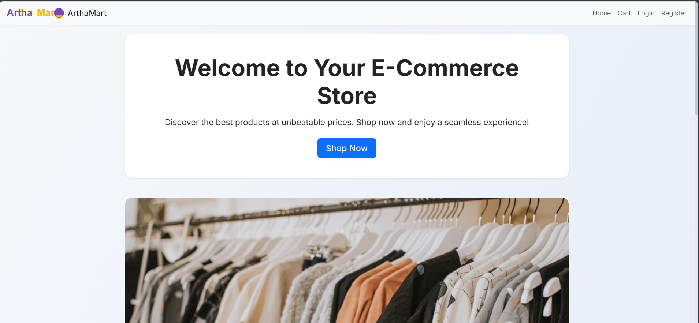
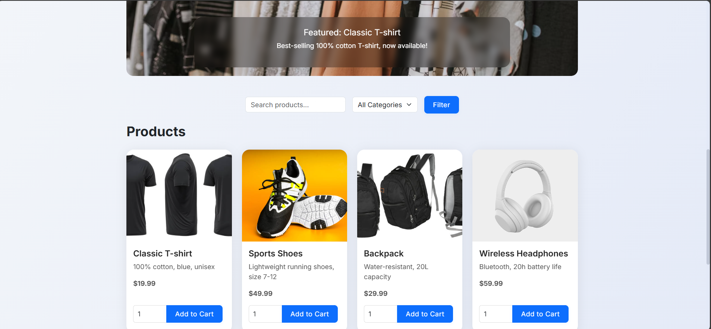
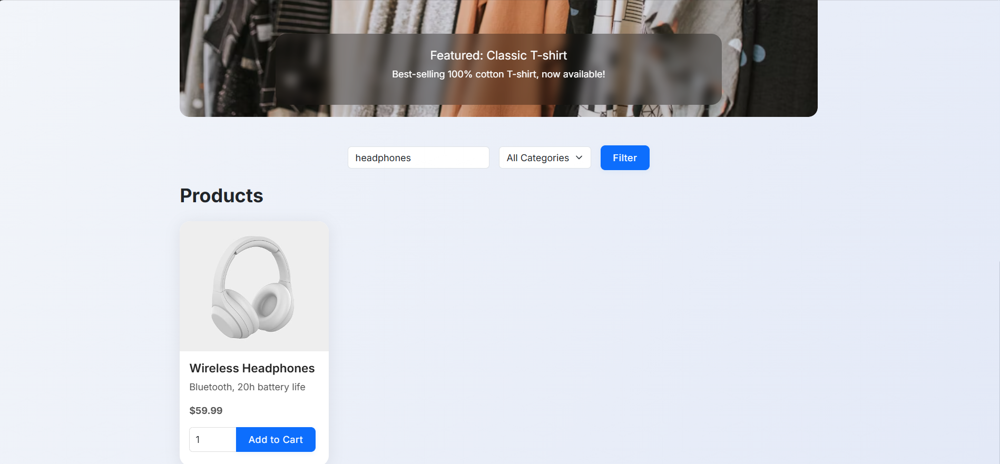
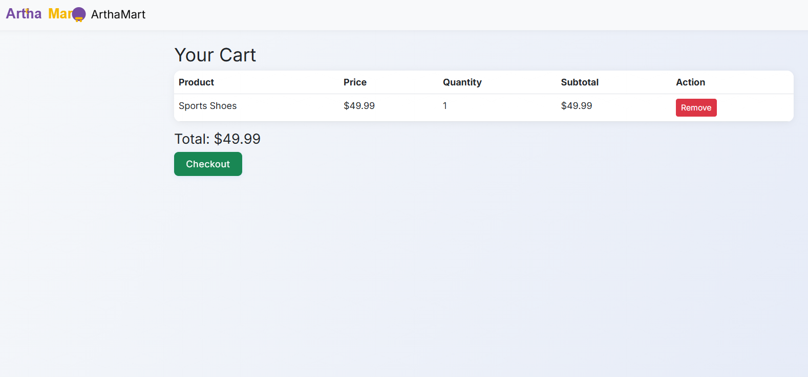
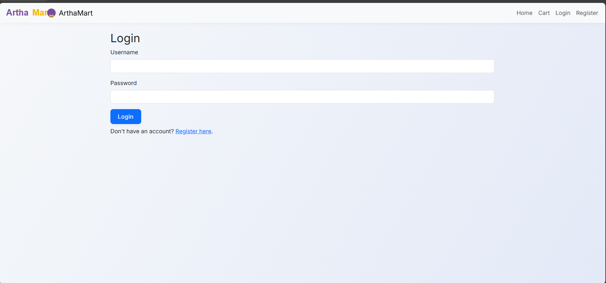
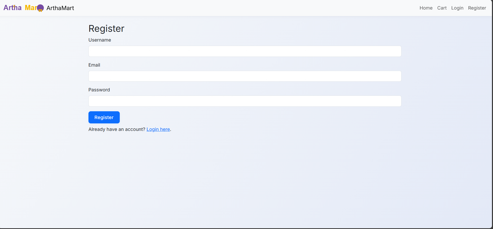

# E-commerce Web Application

This project is a group-based E-commerce web application developed using Python and Flask. The application provides a seamless online shopping experience, including user authentication, product browsing, cart management, and order placement.

**My Contribution:**
I was responsible for the backend development and MySQL database integration. My main tasks included:
- Designing and implementing the database schema in MySQL for users, products, orders, and cart management.
- Developing backend logic in Flask to handle user authentication, product management, cart operations, and order processing.
- Writing secure and efficient SQL queries for data retrieval and manipulation.
- Ensuring smooth communication between the Flask application and the MySQL database.
- Implementing error handling and data validation for backend operations.

## Features

- User Registration and Login
- Product Listing and Search
- Shopping Cart Functionality
- Order Placement and Success Page
- Responsive UI with HTML, CSS, and static images

## Screenshots

### Home Page


### Product Listing


### Search


### Cart


### Login


### Register


## Project Structure

```
E commerce/
│
├── app.py
├── requirement.txt
├── static/
│   ├── images/
│   ├── logo.svg
│   └── style.css
├── templates/
│   ├── base.html
│   ├── cart.html
│   ├── home.html
│   ├── login.html
│   ├── order_success.html
│   └── register.html
└── screenshots/
    ├── Cart.png
    ├── Home.png
    ├── Login.png
    ├── Products.png
    ├── Register.png
    └── Search.png
```

## Getting Started

### Prerequisites

- Python 3.x installed on your system

### Installation

1. **Clone the repository:**
   ```sh
   git clone https://github.com/Utkarsh4412/E-Commerce-Website-Artha-mart-.git
   cd "E commerce"
   ```

2. **Install dependencies:**
   ```sh
   pip install -r requirement.txt
   ```

3. **Run the application:**
   ```sh
   python app.py
   ```

4. **Open your browser and go to:**
   ```
   http://127.0.0.1:5000/
   ```

## Usage

- Register a new account or log in with existing credentials.
- Browse products, search for items, and add them to your cart.
- View your cart and proceed to checkout.
- Place an order and view the order success page.

## Technologies Used

- Python
- Flask
- HTML, CSS
- Jinja2 Templates

## Backend and Database

The backend of this project is built with Flask (a Python web framework) and uses MySQL as the database for storing users, products, orders, and cart information.

### Backend Architecture
- **Flask** handles routing, user authentication, session management, and business logic.
- **MySQL** is used for persistent data storage.
- The backend communicates with the database using a MySQL connector (such as `mysql-connector-python` or `PyMySQL`).

### Database Setup
1. **Install MySQL** on your system if you haven't already.
2. **Create a new database** (e.g., `ecommerce_db`).
3. **Create tables** for users, products, cart, and orders. Example schema:

```sql
CREATE DATABASE ecommerce_db;
USE ecommerce_db;

CREATE TABLE users (
    id INT AUTO_INCREMENT PRIMARY KEY,
    username VARCHAR(50) NOT NULL UNIQUE,
    password VARCHAR(255) NOT NULL
);

CREATE TABLE products (
    id INT AUTO_INCREMENT PRIMARY KEY,
    name VARCHAR(100) NOT NULL,
    description TEXT,
    price DECIMAL(10,2) NOT NULL,
    image VARCHAR(255),
    category VARCHAR(50)
);

CREATE TABLE cart (
    id INT AUTO_INCREMENT PRIMARY KEY,
    user_id INT,
    product_id INT,
    quantity INT DEFAULT 1,
    FOREIGN KEY (user_id) REFERENCES users(id),
    FOREIGN KEY (product_id) REFERENCES products(id)
);

CREATE TABLE orders (
    id INT AUTO_INCREMENT PRIMARY KEY,
    user_id INT,
    order_date DATETIME DEFAULT CURRENT_TIMESTAMP,
    total DECIMAL(10,2),
    FOREIGN KEY (user_id) REFERENCES users(id)
);
```

4. **Configure Database Credentials:**
   - Update your `app.py` (or configuration file) with your MySQL username, password, host, and database name.
   - Example in `app.py`:
   ```python
   db = mysql.connector.connect(
       host='localhost',
       user='your_mysql_user',
       password='your_mysql_password',
       database='ecommerce_db'
   )
   ```

5. **Install MySQL Connector:**
   ```sh
   pip install mysql-connector-python
   ```

6. **Initialize the Database:**
   - Run the above SQL commands in your MySQL client to set up the schema before starting the Flask app.

### Sample Data

To add initial products, run the following SQL (add the `category` column if it does not exist):

```sql
ALTER TABLE products ADD COLUMN category VARCHAR(50);
```

Then insert sample products:

```sql
INSERT INTO products (name, description, price, image, category) VALUES
('Classic T-shirt', '100% cotton, blue, unisex', 19.99, '/static/images/tshirt.jpg', 'Clothing'),
('Sports Shoes', 'Lightweight running shoes, size 7-12', 49.99, '/static/images/sportsshoes.jpg', 'Footwear'),
('Backpack', 'Water-resistant, 20L capacity', 29.99, '/static/images/backpack.jpg', 'Accessories'),
('Wireless Headphones', 'Bluetooth, 20h battery life', 59.99, '/static/images/wirelessheaphones.jpg', 'Electronics'),
('Coffee Mug', 'Ceramic, 350ml, white', 9.99, '/static/images/coffeemug.jpg', 'Home');
```

## License

This project is licensed under the MIT License.

---

**Feel free to customize this README with more details about your project, contributors, or deployment instructions!** 